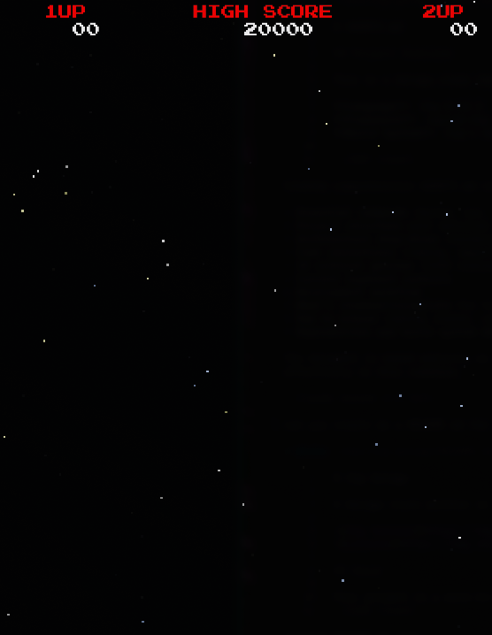

# Zig Galaga

A Galaga clone written in Zig using raylib.


## About

This project is a work-in-progress recreation of the classic arcade game Galaga, built with the Zig programming language and the raylib game framework. The goal is to create an accurate and enjoyable recreation while exploring Zig's capabilities for game development.

## Features

### Currently Implemented

- ✅ High-resolution rendering with 4× SSAA (super-sampling anti-aliasing)
- ✅ Responsive window with letterboxing to maintain aspect ratio
- ✅ Animated starfield background with twinkling stars
- ✅ HUD displaying player scores and high score
- ✅ Attract mode state machine framework
- ✅ Arcade-style font rendering
- ✅ Game state system (attract, intro, credit, play)

### In Development

- 🚧 Player ship and movement
- 🚧 Enemy formations
- 🚧 Shooting mechanics
- 🚧 Collision detection
- 🚧 Sound effects and music
- 🚧 Complete attract mode screens

## Screenshots



## Requirements

- **Zig**: Version 0.15.2 or later
- **System dependencies**: Whatever raylib requires for your platform (typically OpenGL drivers)

## Building

Clone the repository and build:

```bash
git clone https://github.com/yourusername/zig-galaga.git
cd zig-galaga
zig build
```

## Running

Run directly with:

```bash
zig build run
```

Or run the compiled executable from:

```bash
./zig-out/bin/zig_galaga
```

## Controls

| Key | Action |
|-----|--------|
| `F11` | Toggle fullscreen |
| `F3` | Toggle FPS display |
| `ESC` | Quit game |

_Gameplay controls will be added as features are implemented_

## Development

### Project Structure

```
zig-galaga/
├── src/
│   ├── main.zig              # Entry point
│   ├── game.zig              # Main game coordinator
│   ├── renderer.zig          # Rendering system
│   ├── states/               # Game state implementations
│   └── assets/               # Fonts, sprites, sounds
├── build.zig                 # Build configuration
└── build.zig.zon            # Dependencies
```

### Testing

```bash
zig build test
```

### Release Builds

For optimized builds:

```bash
zig build --release=fast      # Optimize for speed
zig build --release=safe      # Optimize with safety checks
zig build --release=small     # Optimize for size
```

## Technical Details

- **Language**: Zig 0.15.2
- **Framework**: raylib-zig (5.6.0-dev)
- **Logical Resolution**: 672×864 (scaled 3× from original 224×288)
- **Render Resolution**: 2688×3456 (4× SSAA for smooth graphics)
- **Target FPS**: 60

The game uses a multi-pass rendering pipeline with super-sampling for crisp visuals and automatic letterboxing for any window size.

## Contributing

Contributions are welcome! Please feel free to submit issues or pull requests.

### Guidelines

- Follow existing code style and conventions (see `AGENTS.md` for details)
- Add tests for new functionality
- Update documentation as needed
- Ensure `zig build` and `zig build test` pass

## License

This project is licensed under the MIT License - see the LICENSE file for details.

## Acknowledgments

- Original Galaga arcade game by Namco
- [raylib](https://www.raylib.com/) - Amazing game development library
- [raylib-zig](https://github.com/raylib-zig/raylib-zig) - Zig bindings for raylib
- Zig community for excellent tooling and language design

## Roadmap

- [ ] Complete player ship implementation
- [ ] Enemy AI and formation system
- [ ] Bullet physics and collision detection
- [ ] Power-ups and special attacks
- [ ] Sound effects and background music
- [ ] High score persistence
- [ ] Complete attract mode with demo playback
- [ ] Particle effects
- [ ] Game difficulty progression
- [ ] Two-player support

## Author

Shane - [Your GitHub Profile](https://github.com/yourusername)

---

**Status**: Early Development 🚀

_This project is a learning exercise and tribute to classic arcade games. No copyright infringement intended._
